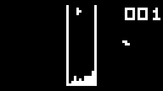
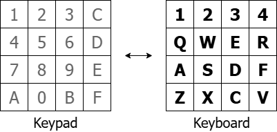

# CHIP-8 Interpreter



[CHIP-8](https://en.wikipedia.org/wiki/CHIP-8) is an interpreted programming language originally used on the COSMAC VIP and Telmac 1800 microcomputers in the 1970s.

This is a CHIP-8 interpreter written in D with SDL3 for the frontend (graphics, input and audio).

## Run the interpreter
### Download and run
[Download for Windows](https://github.com/nungus/chip8-interpreter/releases/latest).

Unzip, and from a terminal in the unzipped directory, run:
```
chip8-interpreter.exe path/to/game.ch8
```

### Where to find games
You can find various sites holding CHIP-8 programs available for download. \
Make sure to get CHIP-8 games, and not SCHIP or XO-CHIP ones!

Example sources:
- https://johnearnest.github.io/chip8Archive/
- https://github.com/kripod/chip8-roms/tree/master/game

## Controls


This project uses a conventional key mapping from the original CHIP-8 keypad to the modern keyboard.

A lot of games don't specify their controls. Test each key if you're unsure!

Also:
- `ESC`: Quit.
- `I`, `O`, `P`: Toggle [quirks](#tests-and-quirks).


## Tests and quirks
This interpreter passes the CHIP-8 tests in [Timendus' test suite](https://github.com/Timendus/chip8-test-suite).

There exist CHIP-8 interpreter variants which operate slightly differently to the original. The default settings in this project fit the quirks on the original COSMAC VIP (see [test 5](https://github.com/Timendus/chip8-test-suite#quirks-test)).


The `I`, `O` and `P` keys toggle _some_ of these quirks.
- `I`: I-Increment. The save and load opcodes (`Fx55`, `Fx65`) increment the index (`I`) register. Affects `MEMORY` in test 5.
- `O`: SetVxToVy. Store the value of `Vy` into `Vx` at the beginning of shift opcodes (`8xy6`, `8xye`). Affects `SHIFTING` in test 5.
- `P`: SpriteInterrupt. Wait for an interrupt before drawing a sprite. An interrupt occurs once a frame, which means you are limited to one sprite-draw per frame. Affects `DISPLAY WAIT` in test 5.

Toggling `I` or `O` off might break programs expecting COSMAC VIP execution. Toggling `P` off might cause unintended execution speeds.


## Build from source
Currently, I have only provided a direct download for a Windows executable. If you want to build the interpreter from the code for another platform, or for any other reason:
- Clone this repository.
- Download a [D compiler](https://dlang.org/download.html). This provides the DUB package manager.\
  The pinned compiler is [DMD v2.113.0](https://downloads.dlang.org/releases/2026/). Other versions are most likely fine.
- Download the [pinned SDL3 DLL (v3.4.16)](https://github.com/libsdl-org/SDL/releases/tag/release-3.4.16) and place it in the repository root. Other versions are most likely fine.\
  This is required to use the SDL bindings, `bindbc-sdl`.

Build the project with `dub build`.

## Technologies used
- D
- SDL3

## Resources / References

- [Cowgod's CHIP-8 Technical Reference](http://devernay.free.fr/hacks/chip8/C8TECH10.HTM)
- [Tvil's Guide to making a CHIP-8 emulator](https://tobiasvl.github.io/blog/write-a-chip-8-emulator/)
- [Laurence Scotford's Chip-8 on the COSMAC VIP: Drawing Sprites](https://laurencescotford.net/2020/07/19/chip-8-on-the-cosmac-vip-drawing-sprites/)
- [corax89's `chip8-test-rom`](https://github.com/corax89/chip8-test-rom)
- [Timendus' CHIP-8 test suite](https://github.com/Timendus/chip8-test-suite)
- [Phobos documentation](https://dlang.org/phobos/index.html)
- [`bindbc-sdl` documentation](https://code.dlang.org/packages/bindbc-sdl)
- [SDL Wiki](https://wiki.libsdl.org/SDL3/FrontPage)

## Prospective To-Do
- Pausing.
- Tick speed adjustments in-app.
- Colour schemes / customisation.
- A menu which encompasses the above points.
- App loads into a menu for selecting ROMs. Also enter this menu from the pause menu (or they are the same thing).

## License
This project is licensed under the MIT license. See [LICENSE](LICENSE).
